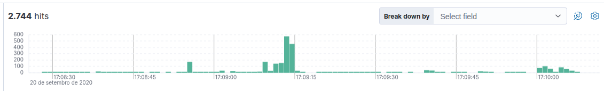
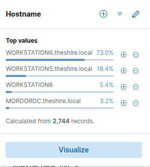
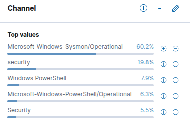
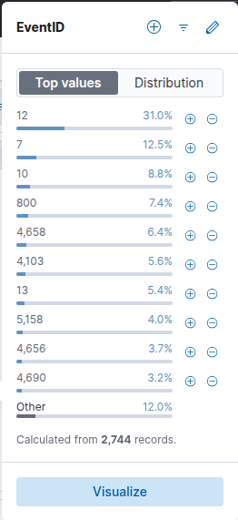
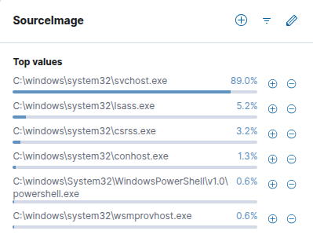
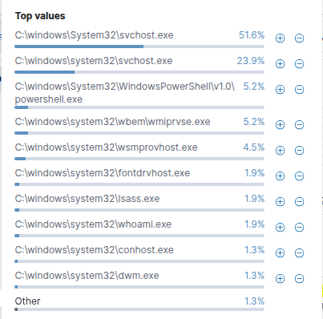
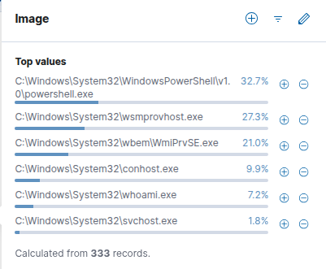
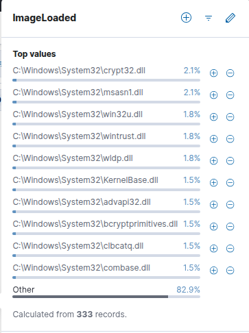

## Investigation and Detection Engineering of Lateral Movement via WinRM (Empire Framework)

This project documents the triage, detailed investigation (Threat Hunting), and creation of detection matrices to contain a Lateral Movement activity in an Active Directory environment. The simulated attack used the Empire post-exploitation framework, executing the Invoke-PSRemoting module.

This method abuses the native WinRM (Windows Remote Management) protocol to establish remote sessions and execute malicious payloads directly in the memory of adjacent systems using compromised administrative credentials.

## General Information

- **MITRE ATT&CK Tactic:** Lateral Movement (TA0008)
- **MITRE ATT&CK Technique:** Remote Services: Windows Remote Management (T1021.006)
- **Project Objective:** Reconstruct the attack timeline, overcome the absence of process creation telemetry, and develop behavioral detection signatures based on network and host logs.

---

### Exploratory Analysis and Reconnaissance (Data Profiling)



The initial triage was performed on a critical mass of data to understand the duration of the attack, the affected targets, and the quality of the available logs.

### Volumetric Mapping and Time Window

- **Total Logs Analyzed:** 2,744 events.
- **Attack Time Window:** From 17:08:28 to 17:10:07 (Total duration of less than 2 minutes).
- **Execution Dynamics:** The first evidence appears at 17:08:55 with an initial batch of 171 records. The absolute peak of the threat is concentrated between 17:09:13 and 17:09:14, recording 400 to 600 activities per second. Other secondary intervals sustained peaks of 60 to 200 activities.

### Automation Analysis

The massive concentration of hundreds of events within a single second confirms the use of automated C2 (Command & Control) tools. It is humanly impossible to type or execute this quantity of commands manually within this time window.

### Active Hosts

The volumetric distribution of activities by Host revealed the threat's contact surface:



### Maximum Criticality Alert

The presence of the Domain Controller (MORDORDC) with 3.2% of activity indicates that the attacker interacted with or attempted authentication against the core of the organization's identity infrastructure during the lateral movement.

A preliminary verification of the Channel field revealed that the telemetry is composed of Sysmon logs, Windows Security audit logs, among other system subchannels.



### Telemetry Distribution (Top Event IDs)

The volumetric extraction of event codes mapped the framework's actions within the Windows ecosystem:



### Identified Telemetry Gap

During the mapping process, the complete absence of Event ID 1 (Process Creation) logs was identified. In response to this common limitation in real-world incidents, the hunting strategy focused strictly on advanced correlation between Event IDs 7 and 10 to expose Empire activity.

---

## Timeline and Deep Investigation

### The Network Vector (Entry Point)

The investigation began by isolating network connections through Event ID 3, capturing a sample of 10 critical events.

### IP Addressing and Port Metrics (General Sample)

| Field | Data / Value | Representation (%) |
|--------|--------------|-------------------|
| Source IP | 172.18.39.5 / 172.18.39.6 | 80.0% / 20.0% |
| Destination IP | 172.18.39.6 / 13.107.4.50 / 10.10.10.5 / 172.18.38.5 | 60.0% / 20.0% / 10.0% / 10.0% |
| Source Port | 59770, 59772, 59773 | 20.0% each |
| | 50593, 50611, 59765, 59769 | 10.0% each |
| Destination Port | 5985 / 8088 / other | 60.0% / 30.0% / 10.0% |

### Network Correlation Focused on the Victim (WORKSTATION6)

By isolating the traffic that specifically touched the target machine (WORKSTATION6), which concentrated 2,003 logs out of the total 2,744, the data revealed:

- Source IP: 172.18.39.5 (60.0%) and 172.18.39.6 (40.0%).
- Destination IP: 172.18.39.6 (60.0%), 10.10.10.5 (20.0%), and 13.107.4.50 (20.0%).
- Destination Port: Port 5985 (WinRM HTTP) accounted for 60.0% of the connections, while port 80 accounted for 40.0%. The associated source ports were dynamic/ephemeral (with 57% grouped under the Other tag in Kibana due to high variability).

### Network Traffic Conclusion

From the mapped host connections, it was determined that the vast majority of communications originated from IP 172.18.39.5 toward IP 172.18.39.6 using destination port 5985. This confirms the vector: lateral movement originating from Workstation 5 abusing the WinRM service on Workstation 6.

> **Note:** Residual connections on port 80 directed to the public IP 13.107.4.50 refer to the legitimate host wec.internal.cloudapp.net and were isolated as normal telemetry traffic.

---

## The Process Trigger (Execution)

With the network vector established, the analysis moved to the endpoint using process access logs (Event ID 10) to understand internal memory interaction on the victim. The activity volume for this ID was distributed between WORKSTATION6.theshire.local (64.7% of 241 events) and WORKSTATION5.theshire.local (35.3%).

### Process Relationship Mapping via Event ID 10

Applying the filter:

```text
event_id : 10 and hostname : *WORKSTATION6.theshire.local*
```

the following distribution of source and target images was identified:

### Source Processes (SourceImage)



### Target Processes (TargetImage)



### Post-Compromise Reconnaissance Signature

The whoami.exe process appears undergoing direct interactions (1.9%) in the TargetImage table. Since C2 frameworks execute automated privilege validation routines (whoami) immediately after consolidating remote access, its presence points to post-exploitation behavior conclusively, mitigating the fact that command-line fields (process.command_line) were not available in the logs for this ID.

---

## The Malicious Payload (Module and DLL Analysis)

Confirmation of execution and the payload's internal behavior were tracked through Event ID 7 (Image Loaded). The asymmetry of this event was conclusive: WORKSTATION6.theshire.local concentrated 96.8% of the 344 isolated occurrences, establishing itself as the attacker's execution laboratory (while WORKSTATION5 recorded only 3.2%).

By isolating the affected Host (333 activities out of 344 total), the IMAGE field revealed which executables triggered memory-resident payloads:



The PowerShell interpreter (powershell.exe) led the ranking with 32.7% of actions. Mapping the associated ImageLoaded field made it possible to read the signature of injected libraries (with 82.9% distributed in the long tail grouped under the Other label).



## Technical Analysis of the Identified DLLs

### wldp.dll (Windows Lockdown Policy)

Module responsible for managing Windows script execution restriction policies (Device Guard / Constrained Language Mode). The PowerShell instance invoked by Empire queries this DLL to assess which local security controls are active and initiate bypass routines.

### crypt32.dll, wintrust.dll and bcryptprimitives.dll

A set of native cryptographic and trust verification libraries. The Empire in-memory agent forces the loading of these modules to perform symmetric decryption of commands received from the C2 server and encrypt stolen data before exfiltration.

---

## Definitive Timeline Reconstruction

#### The Vector (Network)

The attacker positioned on WORKSTATION5 (172.18.39.5) established persistent connections on port 5985 (WinRM) against the target machine WORKSTATION6 (172.18.39.6).

#### The Trigger (Endpoint)

The legitimate WinRM receiver process (wsmprovhost.exe) accepted the authenticated request and spawned an instance of powershell.exe on the victim host.

#### The Execution

The PowerShell process acted anomalously in memory, performing registry key queries (Event ID 12 generating 31% of the total noise) and loading policy verification (wldp.dll) and cryptographic (crypt32.dll) DLLs to host Empire agent activity.

#### The Reconnaissance

Once the in-memory channel was established, the malicious process instantiated the whoami.exe binary (responsible for 7.2% of Event ID 7 loads and 1.9% of Event ID 10 interactions) to audit the privileges gained on the compromised machine.

---

## Automated Detection Engineering

To mitigate the absence of Event ID 1 and provide automated interception capability for the SOC, behavioral signatures focused on stable relational behavior within Windows infrastructure were created.

### Relational Correlation Rule (Elastic EQL)

The rule monitors when the WinRM service process inherits or creates PowerShell command interpreter instances, adding an exception for previously mapped administration scripts.

```sql
process where event.type == "start" and
  process.parent.name : "wsmprovhost.exe" and
  process.name : ("powershell.exe", "pwsh.exe") and
  not process.command_line : ("*LegitimateAdminScript.ps1*")
```

### Portable Detection Rule (International SIGMA Format)

Agnostic rule applicable to multiple SIEM ecosystems (Splunk, QRadar, Sentinel, Chronicle).

```yaml
title: WinRM Service Spawning PowerShell
id: 4b29a28e-5b14-416b-b7bb-944321689dfd
status: production
description: Detects lateral movement activity where the Windows Remote Management (WinRM) utility launches PowerShell for code execution.
author: Security Analyst N2
date: 2026/06/07
tags:
    - attack.lateral_movement
    - attack.t1021.006
logsource:
    product: windows
    service: sysmon
detection:
    selection:
        EventID: 1
        ParentImage|endswith: '\wsmprovhost.exe'
        Image|endswith:
            - '\powershell.exe'
            - '\pwsh.exe'
    condition: selection
falsepositives:
    - Corporate infrastructure automation or configuration management tools (e.g., Ansible, Jenkins, or specific SysAdmin routines).
level: high
```

---

## Conclusion and Action Plan (Remediation)

### Final Diagnosis

The incident was characterized as a classic and successful lateral movement executed in less than 2 minutes using the Empire framework. The attacker used administrative privileges from WORKSTATION5 to compromise WORKSTATION6 via WinRM, leaving clear traces of memory injection and calls to the whoami.exe binary. The residual activity mapped on the Domain Controller (MORDORDC) requires immediate follow-up investigation to rule out the compromise of global domain accounts.

## Hardening and Mitigation Recommendations

### Network Connection Restriction (Local Segmentation)

Apply policies via GPO to configure the Windows Firewall on workstations to reject inbound traffic on ports 5985 and 5986 originating from other user workstations. Only dedicated management servers and approved Jump Boxes should be allowed to initiate WinRM connections to network endpoints.

### Visibility Activation and Correction

Conduct an audit of Windows advanced auditing policies and Sysmon rules deployed in the environment. Restoring Event ID 1 (Process Creation) collection is mandatory to ensure complete recording of command-line arguments (process.command_line) in future incidents.

### PowerShell Constrained Language Mode

Enforce Constrained Language Mode in PowerShell on standard user computers through AppLocker or Windows Defender Application Control (WDAC). This configuration blocks direct calls to .NET APIs and prevents inline injection of malicious code dependent on native cryptographic DLLs (such as crypt32.dll).

### Protection of Critical Processes

Evaluate implementation of the RunAsPPL mechanism to protect the lsass.exe process (which recorded 5.2% of interactions as source and 1.9% as target), preventing extraction or dumping of credential material from memory by remote agents.
